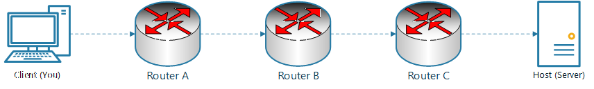
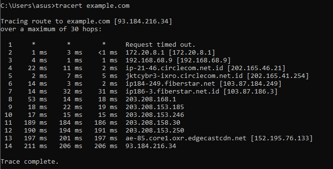
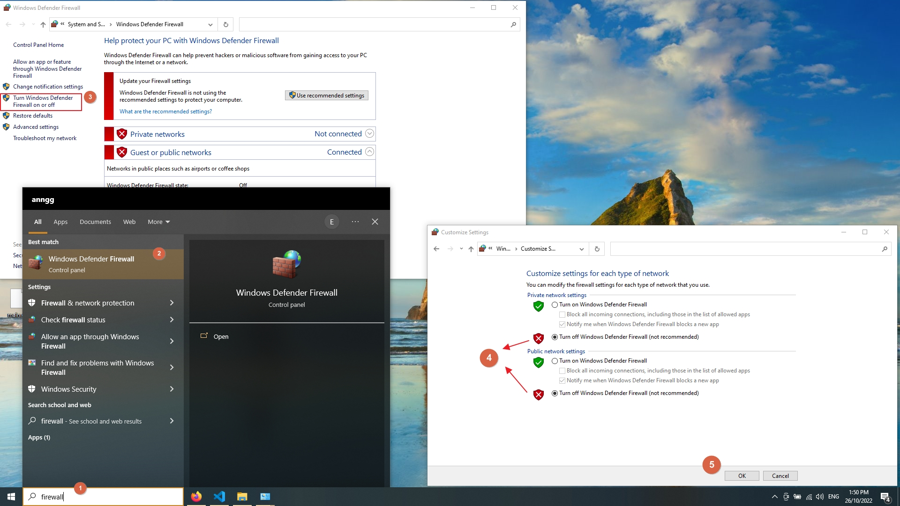
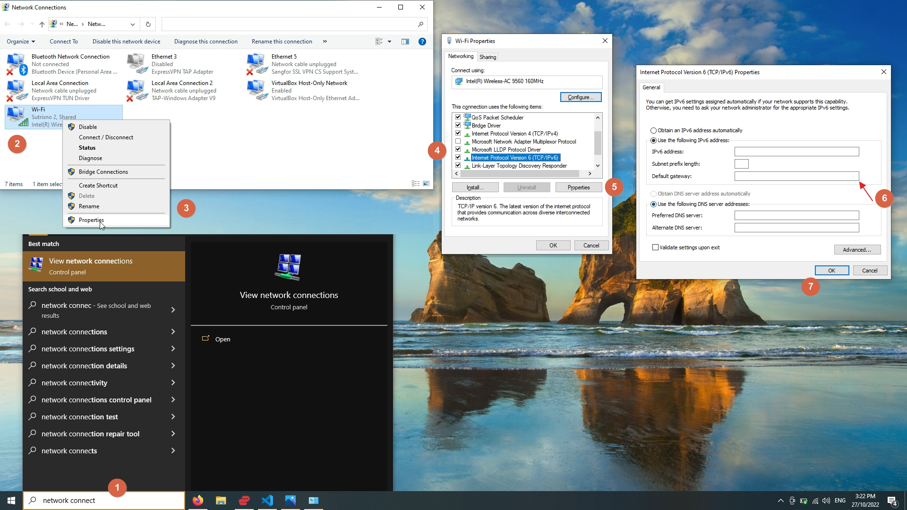
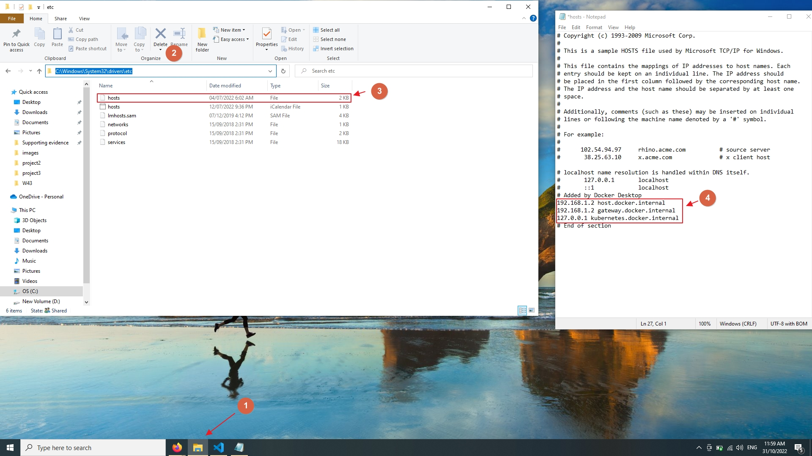
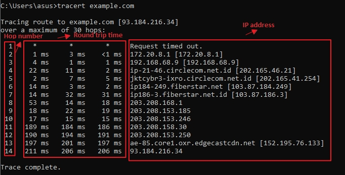
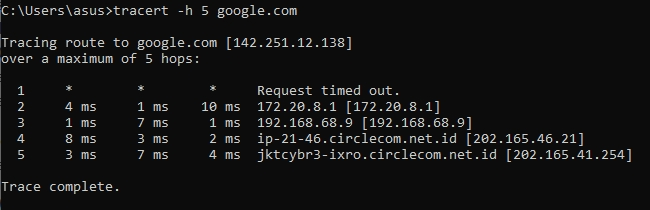

# traceroute

## Table of contents

- [traceroute](#traceroute)
  - [Table of contents](#table-of-contents)
  - [Introduction](#introduction)
    - [What is traceroute](#what-is-traceroute)
    - [Use cases for traceroute](#use-cases-for-traceroute)
    - [Example of the traceroute command and output](#example-of-the-traceroute-command-and-output)
  - [General instructions](#general-instructions)
  - [How-to guides](#how-to-guides)
    - [How to fix !A - Administratively prohibited](#how-to-fix-a---administratively-prohibited)
    - [How to fix !N - Network unreachable](#how-to-fix-n---network-unreachable)
    - [How to fix !H - Host unreachable](#how-to-fix-h---host-unreachable)
    - [How to fix !P - Incompatible protocol](#how-to-fix-p---incompatible-protocol)
  - [Troubleshooting guide](#troubleshooting-guide)
    - [How to disable firewall](#how-to-disable-firewall)
    - [How to set default gateway](#how-to-set-default-gateway)
    - [How to delete entries in hosts file](#how-to-delete-entries-in-hosts-file)
  - [Tutorials](#tutorials)
    - [How traceroute works](#how-traceroute-works)
    - [How to read traceroute results](#how-to-read-traceroute-results)
    - [How to use traceroute with IPv6](#how-to-use-traceroute-with-ipv6)
  - [Snippets](#snippets)
    - [Specify TTL](#specify-ttl)
  - [Explanations](#explanations)
    - [traceroute vs tracert](#traceroute-vs-tracert)
    - [traceroute vs ping](#traceroute-vs-ping)
    - [traceroute alternatives](#traceroute-alternatives)
  - [References](#references)
    - [Windows syntax](#windows-syntax)
    - [MacOS and Linux systems syntax](#macos-and-linux-systems-syntax)

## Introduction

`traceroute` is a command-line tool used to trace the route of the data sent from your computer to a host server over a network.



### What is traceroute

`traceroute` records the time it takes for the data packet to reach a router and record the IP address of the router in the network.

### Use cases for traceroute

The `traceroute` command is used to identify where a problem lies in the network if a data packet cannot reach the destination.

### Example of the traceroute command and output

Here is an example of running `trecert google.com` in Windows terminal.


> _Note: This is the equivalent of running `tracerout google.com` in MacOS and Linux machine._

## General instructions

`traceroute` uses the following syntax in Mac and Linux OS:

```cmd
traceroute [-n] [-w wait_time] [-i initial_ttl] [-m max_ttl] [-p dest_port] [-q nqueries] [-t tos] host [data_size]
```

> _Note: for more information on the Windows syntax, jump to [References](#macos-and-linux-systems-syntax)._

In Windows, the traceroute command is `tracert` and uses the following syntax:

```cmd
tracert [-d] [-h maximum hops] [-j host list] [-w timeout] [-R] [-S scraddr] [-4] [-6] target_name
```

> _Note: for more information on the Windows syntax, jump to [References](#windows-syntax)._

## How-to guides

The `traceroute` command can show you the issues with the connection along the host target.

### How to fix !A - Administratively prohibited

The `!A` response means that the system administrator for your network has blocked the `traceroute` at a certain point. This is usually caused by a firewall. [Disable firewall](how-to-disable-firewall) to fix it:

### How to fix !N - Network unreachable

The `!N` response means that the network is unreachable. Here are some possible reasons:

- Target host does not exist in the routing table of the routers.
- Target server does not exist.
- Security protocols

One possble solution is to [set a default gateway](how-to-set-default-gateway).

### How to fix !H - Host unreachable

The `!H` response means that the host is unreachable. Here are some possible reasons:

- Local system has no route to the desired destination
- Target host does not exist in the routing table on the routers in the path.

Here are some possible solutions:

- [Disable firewall](how-to-disable-firewall)
- [set a default gateway](how-to-set-default-gateway)

### How to fix !P - Incompatible protocol

The `!P` response means that the protocol is unreachable. This is usually due to security reasons.
Here are some possible solutions:

- [Disable firewall](how-to-disable-firewall)
- Restart your router.
- [Delete entries in the _hosts_ file](how-to-delete-entries-in-hosts-file).

## Troubleshooting guide

### How to disable firewall

1. On the search bar, search for _firewall_.
1. Open **Windows Defender Firewall**.
1. Click _Turn Windows Defender Firewall on or off_.
1. Select _Turn off Windows Defender Firewall_ for private and public network.
1. Click **OK** to save changes.



### How to set default gateway

1. On the search bar, search for _network connect_ and select **View network connections**.
2. Right-click on your network.
3. Select **Properties**.
4. From the list, select **Internet Protocol Version 6 (TCP/IPv6)**.
5. Select the **Properties** button.
6. In the Properties tab, set the _Default Gateway address_.
7. Click **OK** to save changes.



### How to delete entries in hosts file

1. Click on _file explorer_.
2. In the search bar, enter `C:\Windows\System32\drivers\etc`.
3. Right click on _hosts_, and open it with a text editor.
4. Delete the entries.



## Tutorials

The `traceroute` command can be used with additional parameters.

### How traceroute works

`traceroute` works by sending 3 data packets, in each hop, aimed at a particular destination, and records the information about the router that it hops to . Each packet will have a TTL value (Time-to-live), which is a count to the number of hops a packet can take before it self-destructs and sends information back to you. After the packet is destroyed, `traceroute` will increment the TTL value of the next hop packets by 1. This process is repeated until a packet reaches the destination.

For example, calling a traceroute command will initially send 3 packets with TTL = 1, so that they can hop to the first router along the path to the target before it self-destructs. Once a packet is destroyed, it will send a packet back to you, along with additional information about the router and the time it takes to travel there. Next, the command will send 3 packets with TTL = 2 so that it can hop the next router towards the destination. This process is repeated until it reaches the target.

### How to read traceroute results

Running `traceroute` will return a table that contains the round trip time of the 3 packets in each hop. There are 5 columns:

- _Hop number_ - This is the first column that show the number of hop along the route to the target.

- _Round trip time_ - This is the second, third and fourth column that shows the time it takes for the round trip time of the 3 packets. By default, `traceroute` sends 3 packets.
  
- _IP Address_ - This is the fifth column that shows the IP address of the router.



### How to use traceroute with IPv6

For Mac or Linux systems, use `traceroute6 [IPv6 address]` to use traceroute with IPv6.
For Windows systems, use `tracert -6 [IPv6 address]` to use traceroute with IPv6. Replace `[IPv6 address]` with the IPv6 address of the domain. For example:

Command:

```cmd
traceroute6 2001:db8::10
```

Result:

```cmd
traceroute to 2001:db8::10
     1 hop min, 30 hops max, 5 sec. timeout, 3 probes
1 2001:db8::a:1c:e3:3           0 ms   0 ms   0 ms
2 2001:db8:0:7::5               7 ms   3 ms   0 ms
3 2001:db8::214:c2ff:fe4c:e480  0 ms   1 ms   0 ms
4 2001:db8::10                  0 ms   1 ms   0 ms
```

Source: [Link](https://techhub.hpe.com/eginfolib/networking/docs/switches/WB/15-18/5998-8170_wb_2920_ipv6_config_guide/content/v33589002.html)

## Snippets

### Specify TTL

In windows, add `-h [max_ttl]` command after `tracert` to specify the max TTL.
In MacOS or Linux, add `-m [max_ttl]` command after `traceroute` to specify the max TTL. Here is an example of setting max TTL to 5:



## Explanations

### traceroute vs tracert

`traceroute` is the command used in MacOS and Linux OS, while `tracert` is the command used in Windows OS. They both have the same functionality and will return the same data.

### traceroute vs ping

`ping` sends a packet to a particular IP address and wait for a reply to check if the address is valid or not.
`traceroute` sends packets of data, with increasing TTL gradually, to trace the exact hops taken to reach a host.
`traceroute` and `ping` are used for troubleshooting network issues.

### traceroute alternatives

Other commands used for troubleshooting network issues:

- `Ping` - Used to check whether a particular IP address is valid or not.
- `Netstat` - Used to check the network connections for TCP, routing tables, and other network protocol statistics.
- `PathPing` - Used to locate spots that have network latency and network loss. This command combines the functionality of `ping` and `tracert`.
- `NSlookup` - Used for querying the DNS to obtain the mapping between a domain name and the IP address.

## References

### Windows syntax

In Windows, `tracert` uses the folllowing syntax:

```cmd
tracert [-d] [-h maximum hops] [-j host list] [-w timeout] [-R] [-S scraddr] [-4] [-6] target_name
```

Here are the description of each parameter:

| Parameters      | Description                                     |
|-----------------|-------------------------------------------------|
| -d              | Do not resolve addresses to hostnames.          |
| -h maximum_hops | Maximum number of hops to search for target.    |
| -j host-list    | Loose source route along host-list (IPv4-only). |
| -w timeout      | Wait timeout milliseconds for each reply.       |
| -R              | Trace round-trip path (IPv6-only).              |
| -S srcaddr      | Source address to use (IPv6-only).              |
| -4              | Force using IPv4.                               |
| -6              | Force using IPv6.                               |

### MacOS and Linux systems syntax

In MacOS and Linux systems, `traceroute` uses the following syntax:

```cmd
traceroute [-n] [-w wait_time] [-i initial_ttl] [-m max_ttl] [-p dest_port] [-q n_queries] [-t tos] host [data_size]
```

Here are the description of each parameterer:
| Parameters       | Description                                                                                                                                                                                                                                                                                                                                                                |
|----------------- |--------------------------------------------------------------------------------------------------------------------------------------------------------------------------------------------------------------------------------------------------------------------------------------------------------------------------------------------------------------------------- |
| -n               | (Optional) Option that prevents traceroute from performing a DNS lookup for each hop on the path. Only numerical IP addresses are printed.                                                                                                                                                                                                                                 |
| -w wait_time     | (Optional) Option used to specify the amount of time (in seconds) that traceroute will wait for an ICMP response message. The allowed range for wait_time is 1 to 300 seconds; the default is 5 seconds.                                                                                                                                                                   |
| -i initial_ttl   | (Optional) Option that causes traceroute to send ICMP datagrams with a TTL value equal to initial_ttl instead of the default TTL of 1. This causes traceroute to skip processing for hosts that are less than initial_ttl hops away.                                                                                                                                       |
| -m max_ttl       | (Optional) Option used to specify the maximum TTL value for outgoing ICMP datagrams. The allowed range for max_ttl is 1 to 255; the default value is 30.                                                                                                                                                                                                                   |
| -p dest_port     | (Optional) Option used to specify the base UDP destination port number used in traceroute datagrams. This value is incremented each time a datagram is sent. The allowed range for dest_port is 1 to 65535; the default base port is 33434. Use this option in the unlikely event that the destination host is listening to a port in the default traceroute port range.  |
| -q n_queries      | (Optional) Option used to specify the number of datagrams to send for each TTL value. The allowed range for n_queries is 1 to 1000; the default is 3.                                                                                                                                                                                                                       |
| -t tos           | (Optional) Option used to specify the TOS to be set in the IP header of the outgoing datagrams. The allowed range for tos is 0 to 255; the default is 0. Use this option to see if different types of service cause routes to change.                                                                                                                                      |
| host             | IP alias or IP address in dot notation (a.b.c.d) of the destination host.                                                                                                                                                                                                                                                                                                  |
| data_size        | (Optional) Number of bytes, in addition to the default of 40 bytes, of the outgoing datagrams. The allowed range is 0 to 1420; the default is 0.                                                                                                                                                                                                                           |                                                                                                                                                                                                                        |

The source is located [here](https://www.cisco.com/E-Learning/bulk/public/tac/cim/cib/using_cisco_ios_software/cmdrefs/traceroute.htm).
