# dig

## Table of contents

- [dig](#dig)
  - [Table of contents](#table-of-contents)
  - [Introduction](#introduction)
    - [What is dig](#what-is-dig)
    - [Use cases for dig](#use-cases-for-dig)
    - [Examples of dig commands and results](#examples-of-dig-commands-and-results)
  - [How-to guides](#how-to-guides)
    - [How to dig a domain](#how-to-dig-a-domain)
      - [General instructions](#general-instructions)
      - [How to dig a domain using a specific DNS server (ie. 8.8.8.8)](#how-to-dig-a-domain-using-a-specific-dns-server-ie-8888)
    - [How to look up a domain by IP using dig command](#how-to-look-up-a-domain-by-ip-using-dig-command)
    - [How to use the .digrc file](#how-to-use-the-digrc-file)
      - [Examples](#examples)
    - [How to find domain IP address using dig](#how-to-find-domain-ip-address-using-dig)
    - [How to find the delegation path to your DNS zone](#how-to-find-the-delegation-path-to-your-dns-zone)
  - [Tutorials](#tutorials)
    - [Query A Records](#query-a-records)
    - [Query MX Records](#query-mx-records)
    - [Query SOA Records](#query-soa-records)
    - [Query TTL Records](#query-ttl-records)
    - [Trace option](#trace-option)
    - [ANY option](#any-option)
  - [Explanations](#explanations)
    - [Short Answers vs Detailed Answers](#short-answers-vs-detailed-answers)
  - [References](#references)
    - [domain](#domain)
    - [q-type](#q-type)
    - [q-class](#q-class)
    - [q-opt](#q-opt)
    - [global-d-opt](#global-d-opt)
    - [Other commands](#other-commands)

## Introduction

`dig` is a command-line tool for inspecting the **Domain Name System (DNS)**.

### What is dig

`dig` stands for _Domain information groper_, which is used to perform **DNS** lookups. It gives information about the domain that is being dig.

### Use cases for dig

The `dig` command is used mainly for network troubleshooting. This command can be used on Linux, MacOS and Windows systems.

### Examples of dig commands and results

Here is an example of running `dig example.com` in Windows terminal.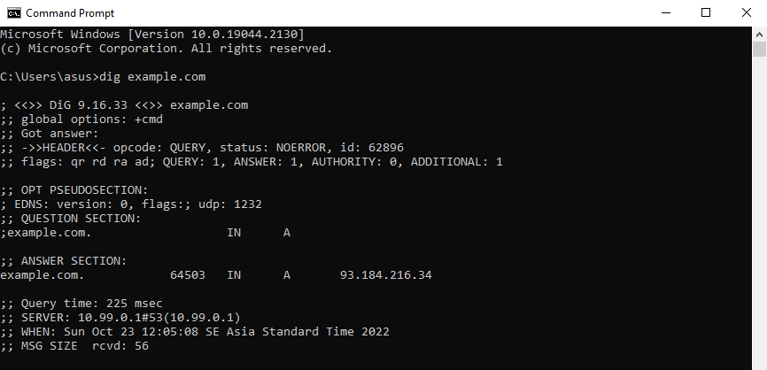
Here is another example of running `dig google.com any` in Windows terminal. 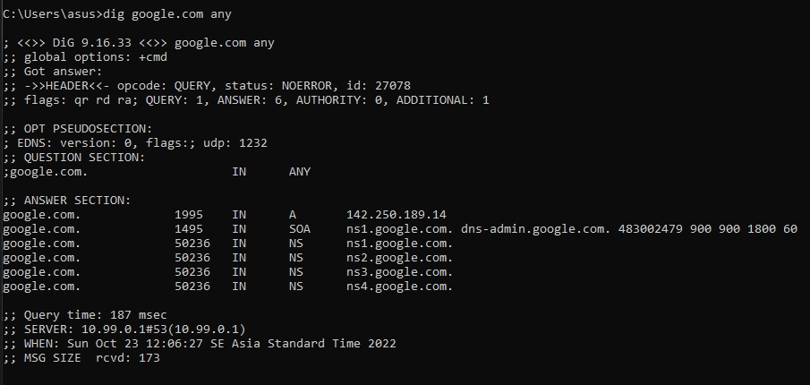

## How-to guides

The `dig` command can be used for querying different things from the **DNS**.

### How to dig a domain

Type in the domain name after the `dig` command to dig a domain. Use the `dig [domain]` format. For example:

Command:

```cmd
dig example.com
```

Result:


#### General instructions

The `dig` command uses the following syntax:

```cmd
dig [domain][q-type][q-class]{q-opt}{global-d-opt}
```

As shown in the syntax above, you can insert up to 5 parameters:

- [domain](#domain)
- [q-type](#q-type)
- [q-class](#q-class)
- [q-opt](#q-opt)
- [global-d-opt](#global-d-opt)

Please see the [references](#references) for a detailed list of what you put in each parameter.

#### How to dig a domain using a specific DNS server (ie. 8.8.8.8)

Add the `@ [DNS server]` after the `dig` command to use a specific server. `Dig` will use the local configuration, if the DNS is not specified.
For example, the following command will specify digging the `example.com` domain using Google's DNS server `8.8.8.8`.

Command:

```cmd
dig @8.8.8.8 example.com
```

Result:

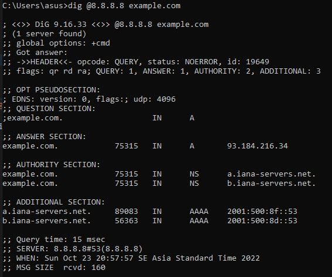

### How to look up a domain by IP using dig command

Use the _reverse lookup option_ `x` to look up a domain by its IP.
For example, the following command will look up `199.43.135.53`.

Command:

```cmd
dig -x 199.43.135.53
```

Result

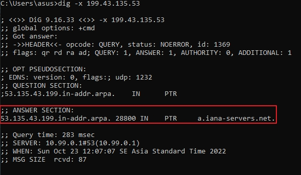

### How to use the .digrc file

The `.digrc` file is used to modify the information displayed by the `dig` commands.

#### Examples

For example, you can modify the `.digrc` file to apply `+noall` and `+answer` to all `dig` commands.
To do so, follow these steps:

1. Use the following command to add `+noall +answer` to the `.digrc` file:

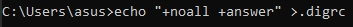

2. Run the `dig` command to see the new changes.

Command:

```cmd
dig google.com
```

Result:

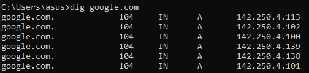

### How to find domain IP address using dig

By default, the `dig` command will give the IP address of the domain. To only show the IP, add `+short` after the domain name.
For example, the following command will return only the IP address of example.com.

Command:

```cmd
dig example.com +short
```

Result:

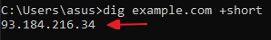

### How to find the delegation path to your DNS zone

Use the `+trace` after the domain name to find the delegation path.
For example, the following command will find the delegation path to example.com

Command:

```cmd
dig example.com +trace
```

Result:

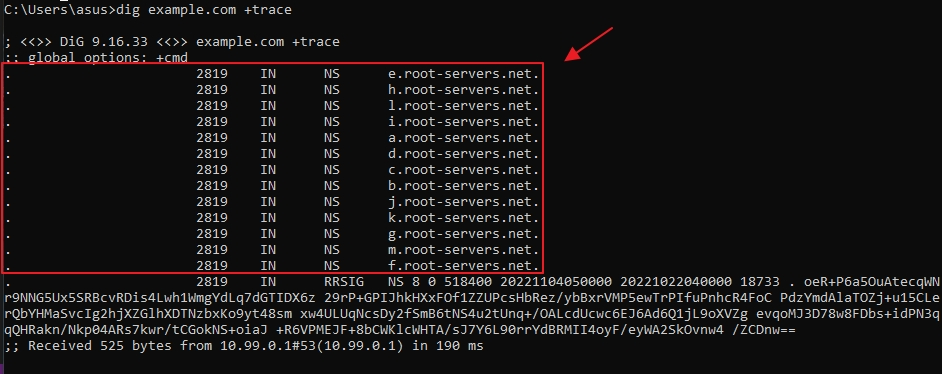

## Tutorials

The `dig` command can be used to query a variety of things by specifying it in the `[q-type]` and `{q-opt}` parameters.

### Query A Records

Add `A` in the `[q-type]` parameter to query A (Host address) records. The `A` records show the IPv4 address of the domain.

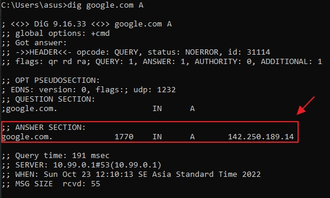

### Query MX Records

Add `MX` in the `[q-type]` parameter to query MX (Mail exchange) records. The `MX` records show the direct emails to the mail server.

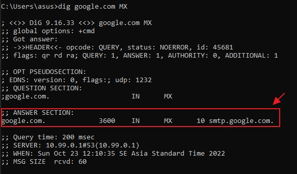

### Query SOA Records

Add `SOA` in the `[q-type]` parameter to query SOA (Start of authority) records. The `SOA` records show the information about the domain or zone, such as the email of the administrator, when the domain was last updated and how long the server should wait between refreshes.

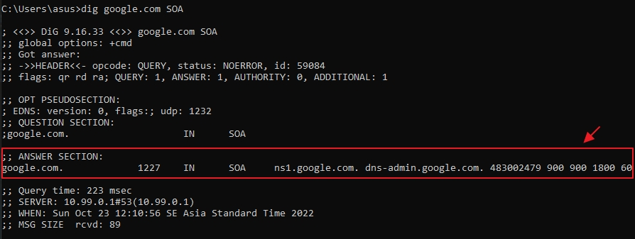

### Query TTL Records

Add `TTL` in the `[q-type]` parameter to query TTL (Time to live) records. The `TTL` records show how long each record is valid and how long it takes for the record updates to reach you.

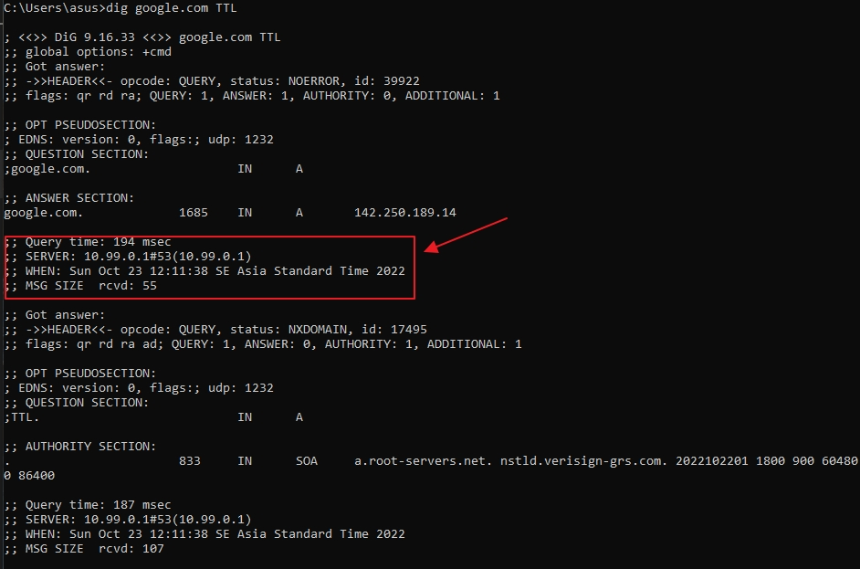

### Trace option

Add `+trace` in the `{q-opt}` parameter to add the trace option. The `+trace` option traces the delegation path from the root name servers for the domain being looked up.

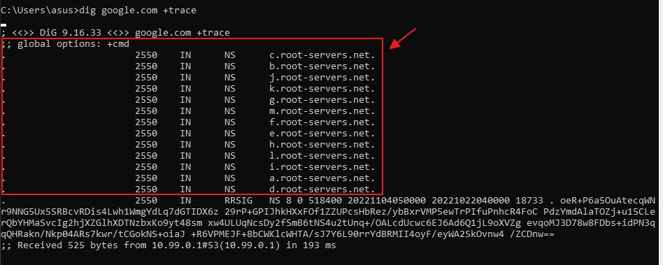

### ANY option

Add `ANY` in the `[q-type]` parameter to query any records. The `ANY` option will show any valid query type.

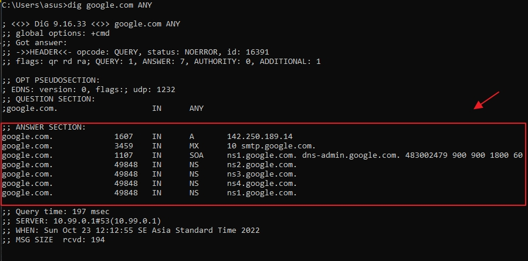

## Explanations

### Short Answers vs Detailed Answers

You can also display the short form answers using `+short`. The short form answer will only show the IP address. The detailed answers will show you the source address, port, query type, class and the IP address. By default, dig will show you the detailed answer.
Here is an example of a detailed answer:


Here is an example of a short answer that only show the IP address:

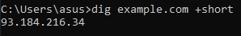

## References

 The `dig` command uses the following syntax:

```cmd
dig [domain][q-type][q-class]{q-opt}{global-d-opt}
```

Here is the list of things that you can put in each parameter.

### domain

The `[domain]` parameter specifies the domain to dig. For example:

```cmd
dig google.com
```

### q-type

The `[q-type]` parameter specifies the DNS query type. By default, the query type is `A` for _Host address_. The list of query types can be found [here](https://www.ibm.com/docs/es/itcam-transactions/7.4.0.1?topic=monitor-dns-query-types).
Here is an example of a command that will `dig` `NS` queries for _Authoritative name server_ in `google.com`:

```cmd
dig google.com NS
```

### q-class

The `[q-class]` parameter specifies the class of the query. By default, the query class is `IN` for _Internet_. Other commonly used query classes are `HS` for _Hesiod_ and `CH` for _CHAOSNET_ records.
Here is an example of a command that specifies the `CH` class query type:

```cmd
dig google.com CH
```

### q-opt

The `{q-opt}` can be used to insert the query options. Multiple query options can be included. The table below shows the list of options for `{q-opt}`:

|**Query options**| **Description**                                                                                           |
|---------------- |-----------------------------------------------------------------------------------------------------------|
| -b _address_    | Sets the source of the IP address of the query. The IP has to be a valid _address_ on the host's network. |
| -c _class_      | To specify the _class_, such as IN for internet, HS for Hesiod or CH for CHAOSNET records.                |
| -f _file_       | Operate the command in batch mode by reading the specified _file_.                                        |
| -k _file_       | Specifies a TSIG key to sign the DNS queries.                                                             |
| -p _port_number_| Queries a non-standard port number.                                                                       |
| -q _name_       | Sets the query name to the name parameter value specified.                                                |
| -t _type_       | Sets the query type.                                                                                      |
| -x _address_    | Shortcut for reverse lookup.                                                                              |
| -y [hmac:]      | specify named base64 TSIG key                                                                             |
| -4              | Use the IPv4 query transport.                                                                             |
| -6              | Use the IPv6 query transport.                                                                             |

The source is located [here](https://www.ibm.com/docs/en/aix/7.1?topic=d-dig-command).

### global-d-opt

The `{global-d-opt}` can be used to insert the global query options. Multiple query options can be included. `{global-d-opt}` affect all queries. The table below shows the list of options for `{global-d-opt}`:

| Parameters            | Description                                                   |
|---------------------- |-------------------------------------------------------------- |
| +[no]aaflag           | Set AA flag in query                                          |
| +[no]aaonly           | Set AA flag in query                                          |
| +[no]additional       | Control display of additional section                         |
| +[no]adflag           | Set AD flag in query                                          |
| +[no]all              | Set or clear all display flags                                |
| +[no]answer           | Control display of answer section                             |
| +[no]authority        | Control display of authority section                          |
| +[no]badcookie        | Retry BADCOOKIE responses                                     |
| +[no]besteffort       | Try to parse even illegal messages                            |
| +bufsize[=###]        | Set EDNS0 Max UDP packet size                                 |
| +[no]cdflag           | Set checking disabled flag in query                           |
| +[no]class            | Control display of class in records                           |
| +[no]cmd              | Control display of command line global option                 |
| +[no]comments         | Control display of packet header and section name comments    |
| +[no]cookie           | Add a COOKIE option to the request                            |
| +[no]crypto           | Control display of cryptographic fields in records            |
| +[no]defname          | Use search list                                               |
| +[no]dnssec           | Request DNSSEC records                                        |
| +domain=###           | Set default domain name                                       |
| +[no]dscp[=###]       | Set the DSCP value to ### [0..63]                             |
| +[no]edns[=###]       | Set EDNS version                                              |
| +ednsflags=###        | Set EDNS flag bits                                            |
| +[no]ednsnegotiation  | Set EDNS version negotiation                                  |
| +ednsopt=###[:value]  | Send specified EDNS option                                    |
| +noednsopt            | Clear list of `+ednsopt` options                              |
| +[no]expandaaaa       | Expand AAAA records                                           |
| +[no]expire           | Request time to expire                                        |
| +[no]fail             | Don't try next server on SERVFAIL                             |
| +[no]header-only      | Send query without a question section                         |
| +[no]identify         | ID responders in short answers                                |
| +[no]ignore           | Don't revert to TCP for TC responses.                         |
| +[no]keepalive        | Request EDNS TCP keepalive                                    |
| +[no]keepopen         | Keep the TCP socket open between queries                      |
| +[no]mapped           | Allow mapped IPv4 over IPv6                                   |
| +[no]multiline        | Print records in an expanded format                           |
| +ndots=###            | Set search NDOTS value                                        |
| +[no]nsid             | Request Name Server ID                                        |
| +[no]nssearch         | Search all authoritative nameservers                          |
| +[no]onesoa           | AXFR prints only one soa record                               |
| +[no]opcode=###       | Set the opcode of the request                                 |
| +padding=###          | Set padding block size. Default value = [0]                   |
| +[no]qr               | Print question before sending                                 |
| +[no]question         | Control display of question section                           |
| +[no]raflag           | Set RA flag in query                                          |
| +[no]rdflag           | Recursive mode                                                |
| +[no]recurse          | Recursive mode                                                |
| +retry=###            | Set number of UDP retries. Default value = [2]                |
| +[no]rrcomments       | Control display of per-record comments                        |
| +[no]search           | Set whether to use a search list                              |
| +[no]short            | Display nothing except short form of answers - global option  |
| +[no]showsearch       | Search with intermediate results                              |
| +[no]split=##         | Split hex/base64 fields into chunks                           |
| +[no]stats            | Control display of statistics                                 |
| +subnet=addr          | Set edns-client-subnet option                                 |
| +[no]tcflag           | Set TC flag in query                                          |
| +[no]tcp              | TCP mode                                                      |
| +timeout=###          | Set query timeout. . Default value = [5]                      |
| +[no]trace            | Trace delegation down from root [+dnssec]                     |
| +tries=###            | Set number of UDP attempts. . Default value = [3]             |
| +[no]ttlid            | Control display of ttls in records                            |
| +[no]ttlunits         | Display TTLs in human-readable units                          |
| +[no]unexpected       | Print replies from unexpected sources default=off             |
| +[no]unknownformat    | Print RDATA in RFC 3597 "unknown" format                      |
| +[no]vc               | TCP mode                                                      |
| +[no]yaml             | Present the results as YAML                                   |
| +[no]zflag            | Set Z flag in query                                           |

The source is located [here](https://www.ibm.com/docs/en/aix/7.1?topic=d-dig-command).

### Other commands

To print the help page of `dig`, use this command:

```cmd
dig -h
```

To print the version of `dig`, use this command:

```cmd
dig -v
```
